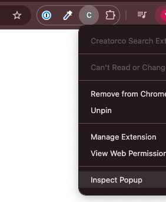

# Creator.co Search Extension

## Local Development
```
npm i
npm run build
```

You will see a new directory created called build/ which contains the necessary files to create a chrome extension app. Once the build succeeds, head over to `chrome://extensions/`, enable `Developer mode` and `Load unpacked` by selecting the build directory that was just created!

### To Debug Extension
Right-click on extension icon, then a window will show up as in screenshot. Click `Inspect Popup` and inspection tool is going to show up.



